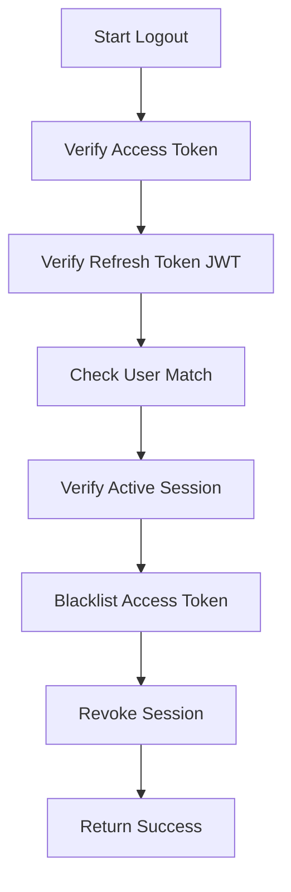

# Authorization Flow

```mermaid
graph TD
    A[Start Logout] --> B[Verify Access Token]
    B --> C[Verify Refresh Token JWT]
    C --> D[Check User Match]
    D --> E[Verify Active Session]
    E --> F[Blacklist Access Token]
    F --> G[Revoke Session]
    G --> H[Return Success]
```
